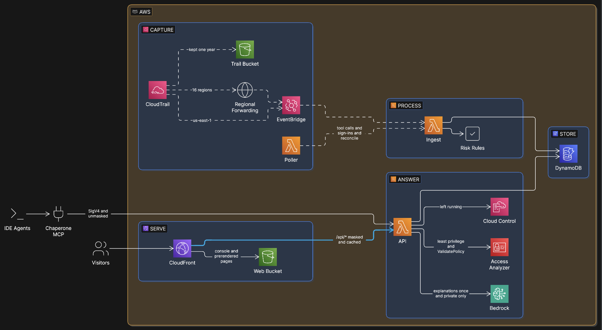

# Chaperone — architecture



Chaperone answers three questions about an AI coding agent's work in an AWS account: what did it do, was anything risky, and what access did it actually need. Everything is serverless and in Terraform (`infra/live`), in us-east-1 except the trail.

## Capture

- **CloudTrail** (multi-region, management events, read and write) is the source of truth. Log file validation is on, so the logs carry tamper evidence. The logs are kept for a year.
- **EventBridge** delivers API-call events to an ingest Lambda within seconds. CloudTrail sends an event to EventBridge only in the region where it happened, so a rule in each of the other enabled regions forwards to us-east-1. An agent working in an unexpected region is exactly what a reviewer needs to see.
- **The poller** (a Lambda, every minute) calls `LookupEvents` for what EventBridge doesn't carry: the AWS MCP Server's tool-call events (`CallReadWriteTool`, with `downstreamRequests`), Identity Center sign-ins, and a reconcile pass. It can backfill.

## The join: three levels

CloudTrail records the agent's AWS calls as calls by its identity, and separately records each MCP tool call with the request IDs of the AWS calls it made. Chaperone joins the two on request ID, in either order of arrival:

```
agent session  →  MCP tool call (aws-mcp.amazonaws.com, user agent names the agent)
                    →  each AWS API call it made (invokedBy: aws-mcp.amazonaws.com)
```

AWS doesn't record the scripts an agent sends through MCP, so Chaperone shows what was called, not the code.

## Store

One DynamoDB table (on-demand, with a throughput cap):
- events are stored per actor (`ACTOR#<actor>` / `<time>#<kind>#<eventID>`), with a 90-day TTL;
- sessions are not stored: they are built at read time (a 30-minute idle gap ends a session). Writes are idempotent, so EventBridge, the poller and a backfill can overlap in any order, and the session rules can change without rewriting data;
- small side records: Access Analyzer jobs (`AAJOB#`), explanations (`EXPLAIN#`), poller cursors.

## Decide

- **Who acted:** an agent is known by its identity (a role name prefix, set up as its own Identity Center permission set), not by its user agent. Terraform run by the agent doesn't announce the agent, but its identity does. The user agent only says which channel: MCP, Terraform, CLI or SDK.
- **Risk:** fixed rules put every call in one class (read, write, destructive, public exposure, identity escalation, audit tampering), with reasons, tested on real recorded events. A model never decides risk.
- **Least privilege:** the actions a session actually used (with `iam:PassRole` recovered from request parameters, since CloudTrail doesn't record it), compared with the policy IAM Access Analyzer generates for the same window.
- **Left running:** resources a session created, checked through Cloud Control.

## Answer

One API Lambda (function URL, `AWS_IAM` auth, reserved concurrency 10) serves every client:
- **The MCP server** runs in the developer's own agent (stdio, five tools) and signs requests with the developer's credentials. It needs only `lambda:InvokeFunctionUrl`. `session_id="me"` resolves to the caller's latest session, so an agent can review its own work.
- **The website** goes through CloudFront, which reaches the function URL through origin access control and adds `x-chaperone-view: public`. A viewer can't remove that header. In that view the API masks identifiers in the finished JSON text (account ID, role suffixes, identity IDs, IP addresses, keys), refuses `id=me` and anything that starts work, serves a slim replay instead of the full timeline, and lets CloudFront cache answers.
- **Explanations:** one Bedrock call per session writes a plain-English account from the same compact facts the MCP server returns. The explanation is stored and marked stale if the session grows afterwards. Only a signed private request (`generate=1`) can call the model, so visitors never cause model cost.

## Serve

The React console (Vite, React 19, Tailwind 4, TanStack Query) is served from S3 through CloudFront. The overview and `/judges` are prerendered at deploy time with the session list, so they read without JavaScript.

## Decisions that shaped it

| Decision | Why |
|---|---|
| The agent gets its own Identity Center identity, not access keys | Everything it does is attributable, even through tools that don't announce it |
| Hybrid ingest: EventBridge for API calls, polling for MCP tool calls | EventBridge doesn't carry MCP tool-call events; `LookupEvents` is free at one call a minute |
| Store events, build sessions when reading | No races between concurrent writers; session rules can change without rewriting data |
| Forward from every enabled region | CloudTrail only delivers to EventBridge in the event's own region |
| Complement AWS, never compete | CloudTrail, IAM Access Analyzer and Detective do their jobs; Chaperone adds the agent's view on top |
| One API, public view switched on by CloudFront | One code path; masking applied last, to the text, so a new field can't slip past it |
| Explanations computed once, no chat | Judges and visitors see the AI's work while the bill stays at a few cents, whatever the traffic |
| Everything in Terraform, adopted by import | The Day 0 resources were imported with zero changes, which proves the code matches what the agent built |

## Limits

- Events arrive as fast as CloudTrail delivers them: seconds through EventBridge, up to a few minutes for MCP tool calls.
- Chaperone records and explains. It never blocks, deletes or reverts: a recorder that acts would be one more agent to watch.
- Built for one account. An organization trail and per-team views are the next step.
