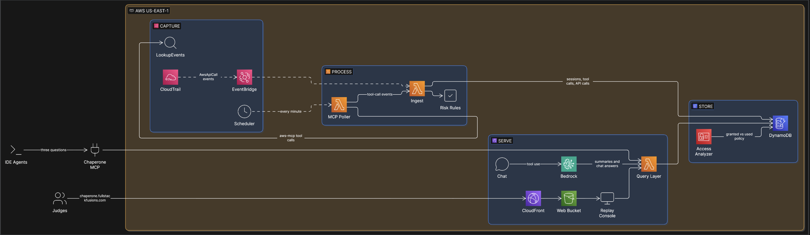

# Chaperone

A flight recorder for AI coding agents in an AWS account. Coding agents such as Claude Code, Kiro, Amazon Q Developer and Cursor now create, change and delete AWS resources through the AWS MCP Server, the CLI and Terraform. CloudTrail records every one of those calls, but nobody reviews the raw events after an agent session. Chaperone reads CloudTrail and answers three questions per session: **what did the agent do, was anything risky, and what access does it actually need?** Risk is decided by deterministic, tested rules, not by a model, and every answer is built on an AWS service (Identity Center, the AWS MCP Server, CloudTrail, EventBridge, Cloud Control, IAM Access Analyzer).

Built for the AWS Zero to Shipped Hackathon (Sep–Oct 2026), by a coding agent, in the AWS account it records.

**Live demo:** https://chaperone.fullstackfusions.com. As of Day 1 (Sep 25) it serves the hello-world page the agent deployed on Day 0; the session-replay console is being built next. The pipeline, the API and the MCP server below are live.

## What it shows

- **Attribution from MCP tool call to each AWS API.** The AWS MCP Server logs each tool call (`CallReadWriteTool`) with a `downstreamRequests` list; Chaperone joins every downstream API event to its tool call by request ID. Terraform, CLI and console calls go on the same timeline, labelled by channel. The agent is recognized by its own Identity Center identity, so its 558 Terraform calls on Day 1 counted as agent activity even though Terraform's user agent doesn't say so.
- **Deterministic risk classes:** `read`, `write`, `destructive`, `identity_escalation`, `public_exposure`, `audit_tampering`. Public exposure is read from the actual payload (bucket policy, security group rule, Lambda URL auth type), not guessed from the API name. The same rules apply to people.
- **What the session left running:** resources created and not deleted, confirmed through the **Cloud Control API**, with idle cost per month from the **AWS Price List API**. Resources the session created and cleaned up, or pre-existing ones it deleted, are listed separately.
- **Guardrails as IAM denies**, one per risky class the session showed. They're scoped to the agent's identity and to the MCP channel (`aws:ViaAWSMCPService`), exempt what the agent itself created, and are validated with **IAM Access Analyzer `ValidatePolicy`** (0 findings, as identity policy and as SCP).
- **Least privilege compared with IAM Access Analyzer's generated policy.** Chaperone's preview is instant; Access Analyzer took 3 min 27 s on the Day 1 build session. 72 of 75 actions matched. Access Analyzer missed `logs:FilterLogEvents` (18 real calls). Both tools miss `iam:PassRole`, which Chaperone recovers from the request parameters.
- **An MCP server**, so an agent can review its own AWS work before it says it's done: `risky_calls("me")` returns the calls from the caller's own latest session.

On Day 1, a coverage check against CloudTrail across all 17 regions matched every agent event: 651 of 651.

## Architecture



The diagram is the target design. Built and running as of Day 1:

- a multi-region CloudTrail trail;
- EventBridge in us-east-1, with forwarding rules from the 16 other enabled regions;
- a one-minute poller that reads MCP tool calls and sign-ins through `LookupEvents` and reconciles each agent's activity;
- the ingest Lambda, with its rules, writing to DynamoDB (on-demand, capped at 100 units/s);
- the API Lambda (function URL, IAM auth);
- the MCP server.

Still to come: the React console, the chat, and the Bedrock summaries. Full design, data model and cost: [docs/architecture.md](docs/architecture.md). How the design grew, phase by phase: [journey/architecture-phases.md](journey/architecture-phases.md).

**No model call per visitor.** The MCP server runs inside your own agent, with your own model, and its tools call no model. On the live site, session summaries and suggested answers are computed once and stored, so visitors' clicks never call a model.

## Folders

| Folder | Contents |
|---|---|
| [`backend/`](backend/) | Python 3.13: ingest, poller and API handlers, attribution, risk rules, sessions, review answers, 103 tests on real recorded CloudTrail events (sanitized) |
| [`mcp/`](mcp/) | The MCP server (stdio, five tools) and an end-to-end smoke test |
| [`infra/`](infra/) | Terraform: `bootstrap/` (state bucket) and `live/` (trail, pipeline, API, regions, web) |
| [`design/`](design/) | Palette generator with measured WCAG contrast |
| [`docs/`](docs/) | [Architecture](docs/architecture.md) |
| [`journey/`](journey/) | Dated build log, decisions, gotchas, diagrams, screenshots |
| [`scripts/`](scripts/) | The export that refreshes this folder from the private working copy, with its leak check |

## Deploy

Requires Terraform ≥ 1.10 and AWS credentials for the target account. Terraform zips `backend/` for the Lambda functions itself. Everything runs in us-east-1; the trail's home region is us-east-2.

```bash
# 1. State bucket (once): chaperone-tfstate-<account-id>-use1.
cp infra/backend.hcl.example infra/backend.hcl   # set bucket to chaperone-tfstate-<account-id>-use1
cd infra/bootstrap
# First apply with local state: comment out the backend "s3" block in main.tf, then
terraform init && terraform apply
# restore the backend block and move the bootstrap's own state into the bucket it created
terraform init -migrate-state -backend-config=../backend.hcl

# 2. The stack
cd ../live
terraform init -backend-config=../backend.hcl
terraform plan -out=live.tfplan -var domain=chaperone.example.com
terraform apply live.tfplan
terraform output api_url
```

Notes:

- `trail.tf` and `web.tf` describe resources first created by hand and then imported, with a plan of 12 imports and 0 changes (see [Day 1](journey/2026-09-25-day1.md)). If your account already has a trail, import it or adjust `trail.tf`; `trail_bucket_suffix` is the random suffix of the trail's log bucket.
- `domain` is the console's custom domain. The ACM certificate uses DNS validation, so add the validation CNAME at your DNS provider, and a CNAME from the domain to the distribution.
- Agent sessions are recognized by role-name prefix: `AGENT_ROLE_PREFIXES` in `infra/live/pipeline.tf`, default `AWSReservedSSO_ChaperoneAgent_` (an Identity Center permission set named `ChaperoneAgent`).
- To load history from before the install, invoke `chaperone-poller` with `{"backfill_user": "<user>", "lookback_minutes": <n>}`.

## Tests

```bash
cd backend && python -m pytest
```

Needs `pytest` and `boto3`. The tests make no AWS calls: they run on real events from the build account, recorded and sanitized (account `111122223333`, documentation IPs, session tokens redacted) in [`backend/tests/fixtures/`](backend/tests/fixtures/).

## MCP server

Install and tool list: [mcp/README.md](mcp/README.md). In short: `claude mcp add chaperone` with `CHAPERONE_API_URL` (the `api_url` output) and an AWS profile allowed to call `lambda:InvokeFunctionUrl` on the API function. Kiro, Amazon Q Developer and Cursor take the same command and environment.

## Built with a coding agent

Claude Code on a headless VPS (`hermes`), signed in as its own IAM Identity Center user, built this through the AWS MCP Server and Terraform. Chaperone recorded it doing so: its first finding was `identity_escalation` on its own build, when the agent attached inline policies to the Lambda roles it had just created. The dated journey, from an empty account on Sep 24, is in [`journey/`](journey/_index.md):

- [Day 0](journey/2026-09-24-day0.md): account hardening, the agent's identity, the AWS MCP Server, the three-level attribution discovery, hello-world live on CloudFront, the EventBridge experiment
- [Day 1](journey/2026-09-25-day1.md): Terraform adoption with zero changes, the pipeline, every region, coverage checks, review answers, Access Analyzer comparison, the MCP server
- [Decisions](journey/decisions.md) · [Gotchas](journey/gotchas.md)

## License

Chaperone is licensed under the [PolyForm Noncommercial License 1.0.0](LICENSE). This folder is not covered by the repository's MIT license: you may use, modify and share it for noncommercial purposes, but commercial use needs a separate license from the author.
