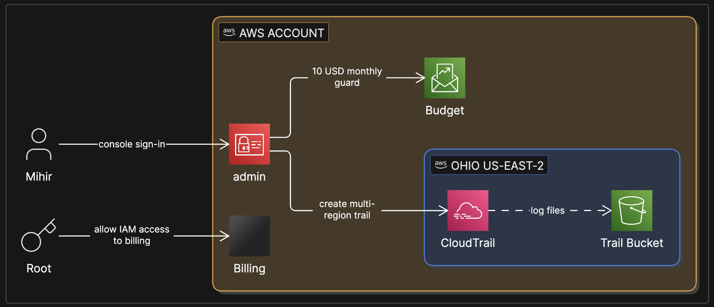
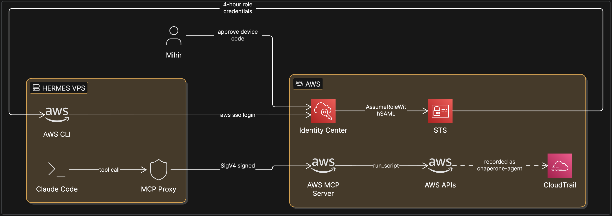
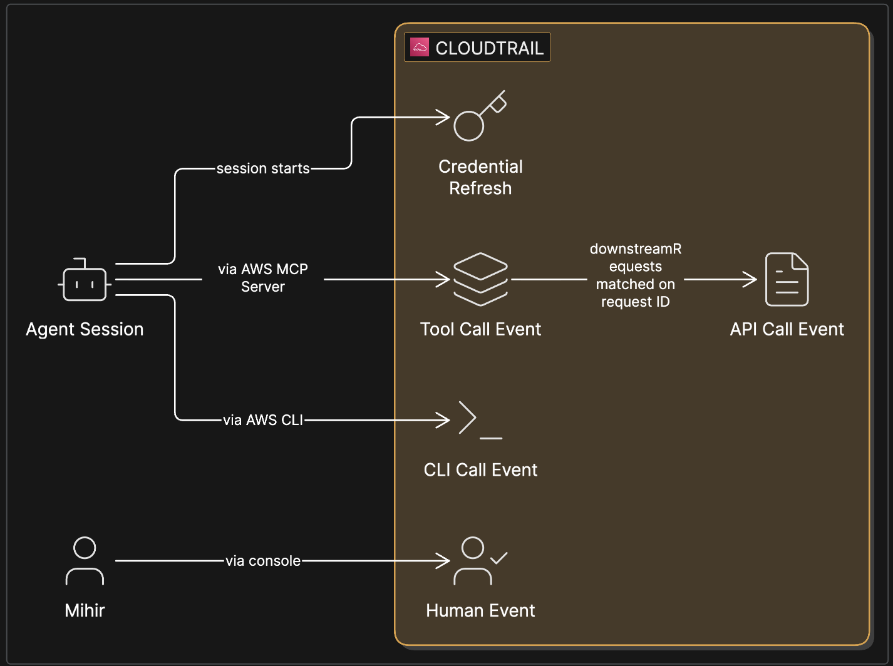
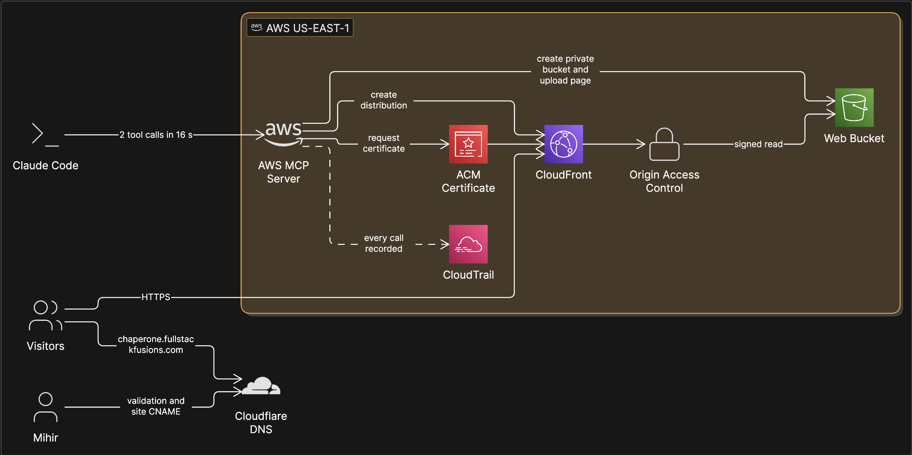
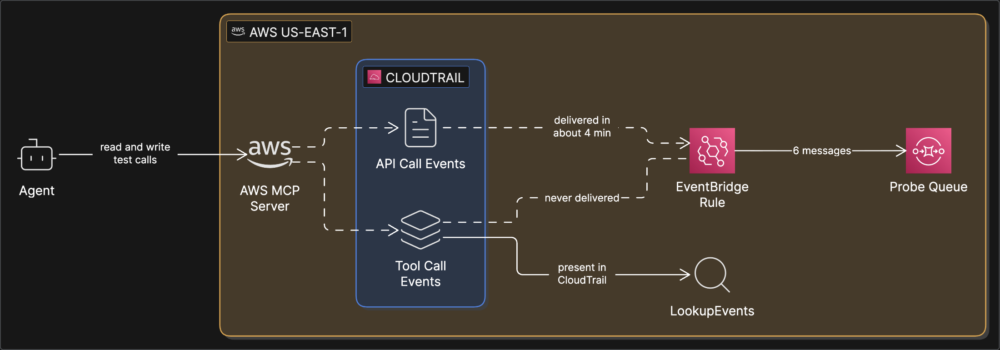

# Architecture by phase

Six diagrams, one per phase, to show in the video how the design grew from an empty account to the final product. Phases 0–4 are what was actually built or tested on Day 0; phase 5 is the target architecture, to be built from Day 1.

**How to use:** paste each block into an Eraser.io "Cloud architecture diagram". Solid arrows (`>`) are direct calls; dotted arrows (`-->`) are asynchronous (events, delivery, polling). Node properties are `icon:` only: Eraser splits properties on commas and ignores quotes, so labels with commas break the diagram. Each node's role is in the "Node roles" paragraph above its block. If an icon name isn't recognized, pick it in Eraser's icon picker; keep names and connections as written.

Suggested video use: one diagram per chapter, or a single animated sequence where each phase adds to the last.

---

## Phase 0 · Hardening the account (the human sets the stage)

Node roles: **Mihir** works in the console as the IAM user **admin** (AdministratorAccess, no access keys). **Root** is used once, to allow IAM users to see billing. **Budget** is `monthly-10usd-guard`. **CloudTrail** is `chaperone-trail`, multi-region with home region us-east-2, writing to the **Trail Bucket** in S3.

```eraser
// Phase 0: hardening the account
direction right
colorMode bold
styleMode shadow
typeface clean

Mihir [icon: user]
Root [icon: key]

AWS Account [icon: aws] {
  admin [icon: aws-iam]
  Billing [icon: aws-billing]
  Budget [icon: aws-budgets]
  Ohio us-east-2 [icon: aws] {
    CloudTrail [icon: aws-cloudtrail]
    Trail Bucket [icon: aws-s3]
  }
}

Root > Billing: allow IAM access to billing
Mihir > admin: console sign-in
admin > Budget: 10 USD monthly guard
admin > CloudTrail: create multi-region trail
CloudTrail --> Trail Bucket: log files
```



---

## Phase 1 · The agent gets its own identity and joins AWS through MCP

Node roles: **Claude Code** runs on the **hermes** VPS. The **AWS CLI** holds the agent's short-lived sign-in, obtained with a **device code** that Mihir approves in his browser. The **MCP Proxy** (`mcp-proxy-for-aws`) signs each request with SigV4 and calls the managed **AWS MCP Server**. **Identity Center** holds the user `chaperone-agent` and the permission set `ChaperoneAgent` (AdministratorAccess, 4-hour sessions); **STS** issues the role credentials. Every call lands in **CloudTrail**.

```eraser
// Phase 1: agent identity and the AWS MCP Server
direction right
colorMode bold
styleMode shadow
typeface clean

Mihir [icon: user]

hermes VPS [icon: server] {
  Claude Code [icon: terminal]
  AWS CLI [icon: aws]
  MCP Proxy [icon: shield]
}

AWS [icon: aws] {
  Identity Center [icon: aws-iam-identity-center]
  STS [icon: aws-iam]
  AWS MCP Server [icon: aws]
  AWS APIs [icon: aws]
  CloudTrail [icon: aws-cloudtrail]
}

Mihir > Identity Center: approve device code
AWS CLI > Identity Center: aws sso login
Identity Center > STS: AssumeRoleWithSAML
STS > AWS CLI: 4-hour role credentials
Claude Code > MCP Proxy: tool call
MCP Proxy > AWS MCP Server: SigV4 signed
AWS MCP Server > AWS APIs: run_script
AWS APIs --> CloudTrail: recorded as chaperone-agent
```



---

## Phase 2 · The discovery: one agent action, three levels in CloudTrail

Node roles: **Tool Call Event** is `CallReadWriteTool` from `aws-mcp.amazonaws.com` (event type `AwsMcpEvent`), whose user agent names Claude Code and whose `downstreamRequests` list each AWS API with a request ID. **API Call Event** is the service's own event, marked `invokedBy aws-mcp.amazonaws.com`. **CLI Call Event** is the agent calling AWS directly from hermes. **Credential Refresh** is the burst of `AssumeRoleWithSAML` in the Identity Center region. **Human Event** is `admin` in the console.

```eraser
// Phase 2: three-level attribution in CloudTrail
direction right
colorMode bold
styleMode shadow
typeface clean

Agent Session [icon: bot]
Mihir [icon: user]

CloudTrail [icon: aws-cloudtrail] {
  Credential Refresh [icon: key]
  Tool Call Event [icon: layers]
  API Call Event [icon: file-text]
  CLI Call Event [icon: terminal]
  Human Event [icon: user-check]
}

Agent Session > Credential Refresh: session starts
Agent Session > Tool Call Event: via AWS MCP Server
Tool Call Event > API Call Event: downstreamRequests matched on request ID
Agent Session > CLI Call Event: via AWS CLI
Mihir > Human Event: via console
```



---

## Phase 3 · Zero to hello-world, built by the agent

Node roles: the agent (through the **AWS MCP Server**) created the private **Web Bucket** with all public access blocked, an **Origin Access Control**, the **CloudFront** distribution and its bucket policy, and the **ACM Certificate** for the custom domain. Mihir added two records in **Cloudflare DNS** (certificate validation and the site CNAME, DNS only). **Visitors** reach `chaperone.fullstackfusions.com`. Everything the agent did is in **CloudTrail**; the DNS work isn't, because it happened outside AWS.

```eraser
// Phase 3: hello-world on CloudFront, built through MCP
direction right
colorMode bold
styleMode shadow
typeface clean

Visitors [icon: users]
Mihir [icon: user]
Cloudflare DNS [icon: cloudflare]
Claude Code [icon: terminal]

AWS us-east-1 [icon: aws] {
  AWS MCP Server [icon: aws]
  CloudFront [icon: aws-cloudfront]
  Origin Access Control [icon: lock]
  Web Bucket [icon: aws-s3]
  ACM Certificate [icon: aws-certificate-manager]
  CloudTrail [icon: aws-cloudtrail]
}

Claude Code > AWS MCP Server: 2 tool calls in 16 s
AWS MCP Server > Web Bucket: create private bucket and upload page
AWS MCP Server > CloudFront: create distribution
AWS MCP Server > ACM Certificate: request certificate
Mihir > Cloudflare DNS: validation and site CNAME
Visitors > Cloudflare DNS: chaperone.fullstackfusions.com
Visitors > CloudFront: HTTPS
CloudFront > Origin Access Control
Origin Access Control > Web Bucket: signed read
ACM Certificate > CloudFront
AWS MCP Server --> CloudTrail: every call recorded
```



---

## Phase 4 · The EventBridge experiment (what reached the rule, and what didn't)

Node roles: a probe **EventBridge Rule** matched every event from `:chaperone-agent`, including read-only events, and sent them to the **Probe Queue** (SQS). **API Call Events** (`AwsApiCall`) arrived within four minutes. **Tool Call Events** (`AwsMcpEvent`) exist in CloudTrail and are visible through **LookupEvents**, but **never reached** the rule. That result led to the hybrid design in phase 5. The probe was deleted afterwards.

```eraser
// Phase 4: EventBridge probe
direction right
colorMode bold
styleMode shadow
typeface clean

Agent [icon: bot]

AWS us-east-1 [icon: aws] {
  AWS MCP Server [icon: aws]
  CloudTrail [icon: aws-cloudtrail] {
    API Call Events [icon: file-text]
    Tool Call Events [icon: layers]
  }
  EventBridge Rule [icon: aws-eventbridge]
  Probe Queue [icon: aws-sqs]
  LookupEvents [icon: search]
}

Agent > AWS MCP Server: read and write test calls
AWS MCP Server --> API Call Events
AWS MCP Server --> Tool Call Events
API Call Events --> EventBridge Rule: delivered in about 4 min
EventBridge Rule > Probe Queue: 6 messages
Tool Call Events -- EventBridge Rule: never delivered
Tool Call Events > LookupEvents: present in CloudTrail
```



---

## Phase 5 · Target architecture: hybrid ingest, three questions, three ways to ask

Node roles: **EventBridge** delivers AWS API call events to the **Ingest** Lambda. A one-minute **Scheduler** runs the **MCP Poller** Lambda, which reads tool-call events through **LookupEvents**. Ingest joins both on request ID, applies the deterministic **Risk Rules**, and writes sessions, tool calls and API calls to **DynamoDB**. **Access Analyzer** generates the least-privilege policy from the trail. The **Query Layer** Lambda answers the three questions (what did the agent do, was anything risky, what access does it need). It is exposed three ways: the **Chaperone MCP** server for **IDE Agents** (Claude Code, Kiro, Amazon Q Developer, Cursor), the website **Chat** (Bedrock tool use over the same functions), and the **Replay Console** (React) served by **CloudFront** from the **Web Bucket**. **Judges** use the website and `/judges`. **Bedrock** also writes session summaries. Everything is in Terraform.

```eraser
// Phase 5: target architecture
direction right
colorMode bold
styleMode shadow
typeface clean

IDE Agents [icon: terminal]
Judges [icon: users]

AWS us-east-1 [icon: aws] {
  Capture [icon: aws-cloudtrail] {
    CloudTrail [icon: aws-cloudtrail]
    EventBridge [icon: aws-eventbridge]
    Scheduler [icon: clock]
    LookupEvents [icon: search]
  }
  Process [icon: aws-lambda] {
    Ingest [icon: aws-lambda]
    MCP Poller [icon: aws-lambda]
    Risk Rules [icon: check-square]
  }
  Store [icon: aws-dynamodb] {
    DynamoDB [icon: aws-dynamodb]
    Access Analyzer [icon: aws-iam]
  }
  Serve [icon: aws-cloudfront] {
    Query Layer [icon: aws-lambda]
    Bedrock [icon: aws-bedrock]
    CloudFront [icon: aws-cloudfront]
    Web Bucket [icon: aws-s3]
    Replay Console [icon: monitor]
    Chat [icon: message-circle]
  }
}

Chaperone MCP [icon: plug]

CloudTrail --> EventBridge: AwsApiCall events
EventBridge --> Ingest
Scheduler --> MCP Poller: every minute
MCP Poller > LookupEvents: aws-mcp tool calls
MCP Poller > Ingest: tool-call events
Ingest > Risk Rules
Ingest > DynamoDB: sessions, tool calls, API calls
Access Analyzer > DynamoDB: granted vs used policy
Query Layer > DynamoDB
Bedrock > Query Layer: summaries and chat answers
IDE Agents > Chaperone MCP: three questions
Chaperone MCP > Query Layer
Judges > CloudFront: chaperone.fullstackfusions.com
CloudFront > Web Bucket
Web Bucket > Replay Console
Replay Console > Query Layer
Chat > Bedrock: tool use
```


---

## Related

- [Journey index](_index.md) · [decisions](decisions.md) (D-006, D-007, D-009, D-018 explain the turns between phases)
- [Chaperone architecture](../docs/architecture.md)
