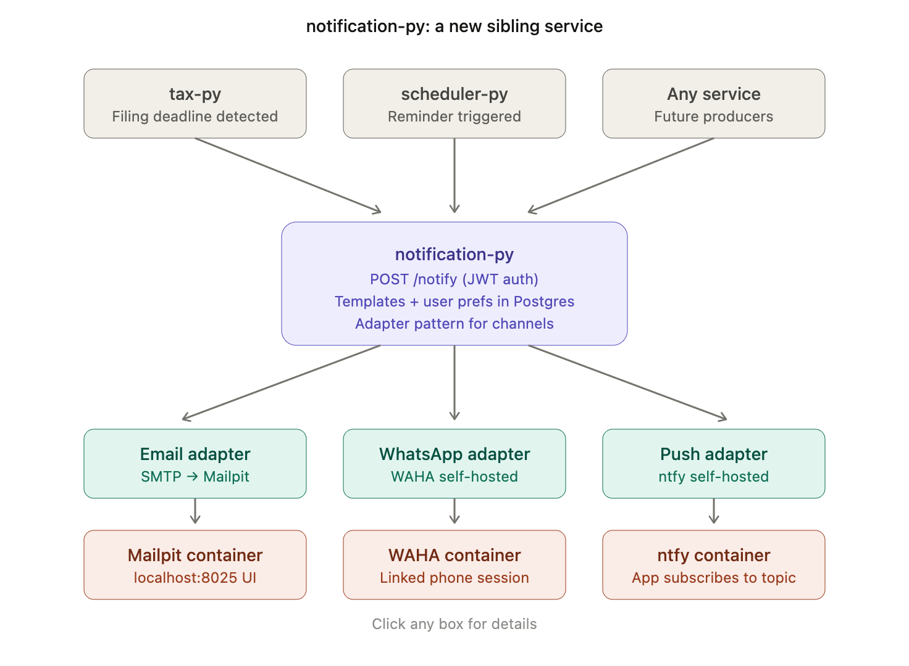

Got it — and looking at your changelog, this fits cleanly into your existing pattern. You've already got `scheduler-py` with `events`/`reminders` tables, `shared-py` for common infra, and a Docker-first local setup. A notification service is the natural next sibling.

Let me think through this as a Principal Engineer would: **what's the architecture**, not just the tools.Here's how I'd think about this in the context of *your* monorepo:




## Why a separate `notification-py` service

Looking at your changelog, you've nailed service isolation: `tax-py` doesn't depend on `scheduler-py` at startup, calls are lazy HTTP, every service has its own DB. A notification feature inside `tax-py` would break that pattern — *every* future service (todo-go reminders, marketplace order confirmations, auth password resets) will want notifications. Centralize once.

This also keeps `tax-py` clean: tax filing logic doesn't deserve to know how WhatsApp works.

## Channel-by-channel: self-hosted picks for your stack

### Email → Mailpit

Drop-in SMTP catcher. Add to `docker-compose.yml`:

```yaml
mailpit:
  image: axllent/mailpit:latest
  ports:
    - "1025:1025"
    - "8025:8025"
  healthcheck:
    test: ["CMD", "wget", "--spider", "-q", "http://localhost:8025"]
```

Your adapter just uses `aiosmtplib` to `smtp://mailpit:1025`. View all sent mail at `http://localhost:8025`. When you're ready for real delivery, swap SMTP host via env var — code unchanged.

### WhatsApp → WAHA (WhatsApp HTTP API)

This is the only legit *self-hosted* option. It's a Docker container that runs a headless WhatsApp Web session, exposes an HTTP API. You scan a QR code once with your phone, then POST JSON to send messages.

```yaml
waha:
  image: devlikeapro/waha:latest
  ports:
    - "3000:3000"
  volumes:
    - waha_sessions:/app/.sessions
```

```python
async def send_whatsapp(phone: str, body: str):
    async with httpx.AsyncClient() as c:
        await c.post("http://waha:3000/api/sendText", json={
            "session": "default",
            "chatId": f"{phone}@c.us",
            "text": body,
        })
```

**Important caveat as your mentor:** WAHA uses unofficial WhatsApp Web protocol. For *personal use among friends* it's fine and very common. **Do not** ship this in any product touching RBC or real customers — Meta can ban the number, and it violates ToS. For a friends-and-family taxation app, totally acceptable.

If you want a clean upgrade path: design the adapter interface so `WAHAAdapter` and `MetaCloudAPIAdapter` are swappable. Meta's Cloud API is free for 1000 conversations/month and is the production-grade path.

### Push notifications → ntfy (self-hosted)

True SMS costs money. Push notifications to phones are free and arguably better — they support rich content, actions, and don't have carrier limits.

```yaml
ntfy:
  image: binwiederhier/ntfy:latest
  command: serve
  ports:
    - "8080:80"
  volumes:
    - ntfy_cache:/var/cache/ntfy
  environment:
    - NTFY_BASE_URL=http://ntfy
    - NTFY_AUTH_FILE=/var/lib/ntfy/user.db
    - NTFY_AUTH_DEFAULT_ACCESS=deny-all
```

Your friends install the ntfy app, subscribe to their private topic. To send:

```python
async def send_push(topic: str, title: str, body: str, priority: int = 3):
    async with httpx.AsyncClient() as c:
        await c.post(f"http://ntfy/{topic}",
            content=body.encode("utf-8"),
            headers={"Title": title, "Priority": str(priority)})
```

For tax filing reminders this is honestly *better* than SMS — you can deep-link into your app, set urgency, attach files.

## How to integrate this into your monorepo

Follow the canonical layout you've already established:

```
backends/notification-py/
├── app/
│   ├── main.py                    # create_app(), ≤80 LOC
│   ├── config.py                  # extends shared.config.AppSettings
│   ├── lifespan.py                # manages adapter clients
│   ├── routers/
│   │   ├── notify.py              # POST /notify
│   │   └── preferences.py         # CRUD user channel prefs
│   ├── schemas/
│   │   └── notification.py        # NotificationRequest, NotificationResult
│   ├── models/
│   │   └── preference.py          # SQLAlchemy: user_id → enabled channels
│   ├── crud/
│   │   └── preferences.py
│   ├── services/
│   │   └── dispatcher.py          # picks adapters based on user prefs
│   ├── domain/
│   │   └── adapters/
│   │       ├── base.py            # NotificationAdapter protocol
│   │       ├── email.py           # SMTP via aiosmtplib
│   │       ├── whatsapp.py        # WAHA HTTP client
│   │       └── push.py            # ntfy HTTP client
│   └── tests/
├── migrations/
│   └── versions/0001_initial.py   # notification_prefs, notification_log
├── alembic.ini
├── pyproject.toml
├── Dockerfile
└── .env.example
```

The adapter protocol is the principal-level move here:

```python
from typing import Protocol

class NotificationAdapter(Protocol):
    channel: str
    async def send(self, *, to: str, subject: str, body: str, **kwargs) -> str:
        """Returns external_message_id. Raises NotificationError on failure."""
```

Dispatcher fans out based on user preferences + a template ID:

```python
async def dispatch(event: NotificationEvent, user_prefs: UserPreferences):
    results = []
    for channel in user_prefs.enabled_channels:
        adapter = self.adapters[channel]
        try:
            msg_id = await adapter.send(
                to=user_prefs.address_for(channel),
                subject=event.subject,
                body=event.render(channel),
            )
            results.append(Success(channel, msg_id))
        except NotificationError as e:
            results.append(Failure(channel, str(e)))
            log.exception("notification_failed", extra={"channel": channel})
    return results
```

## What I'd build first (incremental delivery)

If I were sitting in a sprint planning for this with you, here's the order:

| Phase | Scope | Why this order |
|---|---|---|
| 1 | Mailpit + email adapter + `POST /notify` with email-only | Smallest viable slice, validates the whole flow |
| 2 | `notification_prefs` table + Alembic migration + user prefs API | Lock down the data model before adding channels |
| 3 | ntfy + push adapter | Easier than WhatsApp, gives you mobile delivery |
| 4 | WAHA + WhatsApp adapter | Most setup friction (QR scan, session volume), do last |
| 5 | `tax-py` integration — emit notifications on filing deadline checks | Real producer, proves the contract |
| 6 | Retry + dead-letter via Redis (you already have it for OAuth state) | Production hardening |

## Things worth thinking about as a Principal would

**Idempotency.** Tax reminders running in a scheduler will retry. Add a `notification_log` table with `(user_id, template_id, dedup_key)` unique constraint. The `dedup_key` is something like `tax_deadline_{user_id}_{tax_year}_{days_before}`. Saves you from spamming Shivani about T2 filings six times.

**Templates.** Don't hardcode message bodies in adapters. Use Jinja2 templates per-channel:
```
templates/
  tax_deadline/
    email.html
    whatsapp.txt
    push.txt
```
Email gets HTML with branding; WhatsApp gets concise text with emoji; push gets a short title + body. Same event, three renderings.

**Observability.** Every notification dispatch logs `request_id`, `user_id`, `channel`, `template_id`, `result`. You already have `shared.logging` JSON formatter — use it. When something doesn't arrive, you'll grep the logs in 5 seconds instead of 5 hours.

**Don't reach for Kafka yet.** I know you're deep in Kafka land at RBC and the streaming pattern is appealing. For 10 users and a tax deadline workflow, synchronous HTTP from `tax-py` → `notification-py` is correct. Add a queue only when you hit real backpressure (batch sends, rate limits on WhatsApp). Premature event-driven architecture is a classic Principal interview trap.

Want me to sketch the `shared-py`-style `NotificationAdapter` protocol and the Alembic migration as a starter PR scaffold? Or work through the template rendering layer first?
