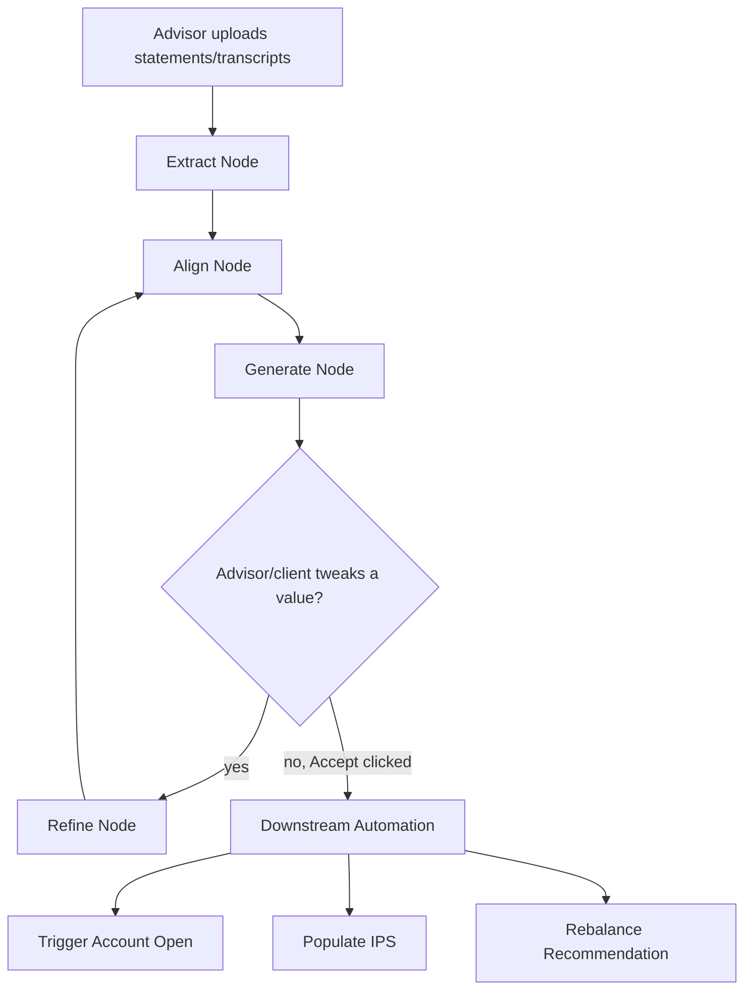

# Team 21: Debug & Conquer — Implementation Plan

## 1. The One Thing to Remember

**Judges score a story, not a codebase.** One polished "Golden Path" demo beats five half-working features. Every task below exists to serve one end-to-end journey: **the onboarding of "Prospect Sarah."**

> Sarah arrives with a stack of bank statements and a messy notes folder. The advisor uploads them. The AI extracts her financial picture, generates a proposal, and — when Sarah says _"I want to retire two years earlier"_ — updates it live. She accepts. The system auto-triggers account opening, IPS population, and (once funds land) a portfolio rebalance recommendation.

If a task doesn't make that journey better, it's optional. Say no to it.

## 2. Team Roles

| Role                         | Owns                                                                                               | Primary Focus                       |
| ---------------------------- | -------------------------------------------------------------------------------------------------- | ----------------------------------- |
| **Orchestrator Lead**        | LangGraph state machine (Extract → Align → Generate → Refine), state schema                        | Early — this unblocks everyone else |
| **Extraction Agent Dev**     | Parsing unstructured statements/transcripts into a structured profile (Node 1)                     | Early                               |
| **Research & Alignment Dev** | RAG over fund fact sheets + risk-alignment rules (Node 2)                                          | Early–mid                           |
| **Proposal & Tweak Dev**     | Proposal generation + the real-time "Refine" loop (Nodes 3–4)                                      | Mid                                 |
| **Downstream & Infra Dev**   | MongoDB schema, IPS templates, mock Broadridge/Client Source trigger, rebalance simulation, Docker | Early–mid                           |
| **UI/UX & Demo Lead**        | Streamlit dashboard, sliders, advisor approval flow, presentation script                           | Mid–late                            |

Everyone joins for full rehearsal once the golden path works end to end. The Orchestrator Lead and UI/UX & Demo Lead co-own the final demo script since they touch both the graph output and how it's displayed.

## 3. Repository Structure

Create this exact structure so nobody blocks on "where does this file go":

```
project-21/
├── docker-compose.yml
├── requirements.txt
├── README.md
├── data/
│   ├── prospect_statement_sarah.csv    # mock bank/brokerage statement
│   ├── prospect_transcript_sarah.txt   # mock meeting notes
│   ├── risk_questionnaire.json         # mock risk profile answers
│   ├── fund_fact_sheets.json           # mock product/research material
│   ├── risk_alignment_rules.json       # risk score -> asset mix rules
│   ├── ips_template.json               # Investment Policy Statement schema
│   ├── portfolio_snapshots.json        # mock "existing portfolio" state
│   └── proposal_versions.json          # version history (V1 vs. tweaked V2)
├── app/
│   ├── main.py                         # Streamlit entrypoint
│   ├── prompts/
│   │   └── system_prompts.py           # scripted rubric prompts (Section 6)
│   ├── graph/
│   │   ├── state.py                    # ClientOnboardingState schema
│   │   ├── build_graph.py              # wires LangGraph nodes + edges
│   │   ├── extract_node.py             # Node 1: unstructured -> structured profile
│   │   ├── align_node.py               # Node 2: risk alignment via research material
│   │   ├── generate_node.py            # Node 3: build the proposal
│   │   └── refine_node.py              # Node 4: the "tweak" loop back to Align/Generate
│   ├── tools/
│   │   ├── document_tools.py           # parse_statement(), parse_transcript()
│   │   ├── research_tools.py           # get_fund_fact_sheet(), get_risk_alignment()
│   │   └── downstream_tools.py         # trigger_account_open(), populate_ips(), check_rebalance()
│   ├── db/
│   │   ├── mongo_client.py
│   │   └── seed_data.py                # loads data/*.json into Mongo on startup
│   └── ui/
│       ├── dashboard.py                # extracted insights (left) + proposal (right)
│       └── components.py               # tweak sliders, approval button, IPS/rebalance views
```

## 4. Architecture — Stateful Extract–Align–Generate–Refine Graph



This is not a one-shot pipeline — the **Refine loop is the whole point**. When the advisor drags the "Risk Tolerance" or "Retirement Age" slider, the state re-enters at Align, not at Extract, and the LLM re-reasons over the same extracted profile with new constraints. That live loop is what proves "real-time AI insight" to the judges, not a static report.

## 5. Data Model — Mock Data

prepare **at least two distinct prospect profiles** (e.g. a Conservative one and an Aggressive Growth one) — one prospect can't show the AI reasoning differently based on risk tolerance, which is what the GenAI Leverage score actually rewards.

### 5.1 — Unstructured Prospect Data (`data/prospect_transcript_sarah.txt`, `prospect_statement_sarah.csv`)

This is intentionally messy free text/tabular data, not clean JSON — that's the point, the Extract node has to do real work.

```
# prospect_transcript_<name>.txt — one pattern; team writes 1–2 more per profile
Advisor: What's on your mind for retirement?
Prospect: I want to retire at <age>. I'm <risk descriptor, e.g. "worried about market volatility">.
I also need to save for <goal, e.g. "my daughter's university in 5 years">.
```

```csv
# prospect_statement_<name>.csv — one pattern row; team adds more accounts/holdings
account_type,holding,value,asset_class
Checking,Cash,15000,Cash
```

### 5.2 — Product & Research Material (`data/fund_fact_sheets.json`, `risk_alignment_rules.json`)

```json
// fund_fact_sheets.json — one pattern; team adds ~4-9 more funds
{"fund_name": "<fictional fund name>", "risk_rating": 6, "historical_return_pct": 8.2, "asset_class": "<Equity|Fixed Income|Balanced>"}

// risk_alignment_rules.json — one pattern rule; team adds the rest of the scale
{"risk_score_min": 4, "risk_score_max": 4, "equity_pct": 40, "fixed_income_pct": 60}
```

### 5.3 — Downstream System Data (`data/ips_template.json`, `portfolio_snapshots.json`)

```json
// ips_template.json — the schema shape; fields the team should populate per proposal
{"client_id": "<id>", "account_type": "<RRSP|TFSA|Non-Registered>", "target_asset_mix": {"equity_pct": 0, "fixed_income_pct": 0}, "compliance_flag": false}

// portfolio_snapshots.json — one pattern "existing portfolio" record
{"client_id": "<id>", "current_asset_mix": {"equity_pct": 0, "fixed_income_pct": 0}, "cash_position": 0}
```

### 5.4 — Application State: Proposal Version History (`data/proposal_versions.json`)

This is what makes the "tweak" demo credible — a V1 vs. V2 diff the advisor can point at on screen. **Don't author this until the Refine loop actually works** — the versions have to reflect a real state change, not an invented one.

```json
{
  "client_id": "<id>",
  "version": 1,
  "trigger": "<initial generation | e.g. 'retirement age changed to 58'>",
  "asset_mix": { "equity_pct": 0, "fixed_income_pct": 0 },
  "risk_tolerance": "<Conservative|Moderate|Aggressive>"
}
```

## 6. Agent State & Prompts

**`app/graph/state.py`** — the shared object every node reads/writes:

```python
from typing import TypedDict, Literal

class ClientOnboardingState(TypedDict):
    prospect_id: str
    raw_documents: list[str]              # uploaded statement/transcript text
    extracted_profile: dict                # assets, income, goals, risk signals
    risk_tolerance: Literal["conservative", "moderate", "aggressive"]
    asset_mix: dict                        # {"equity_pct": int, "fixed_income_pct": int}
    proposal_version: int
    tweak_log: list[str]                   # the "thought chain" shown in the UI
    advisor_approved: bool
    ips_populated: bool
    rebalance_recommendation: dict | None
```

`proposal_version` increments and `tweak_log` gets a new entry every time Refine fires — this is what makes the "real-time re-calculation" requirement in `plan.md` real instead of cosmetic. If the advisor drags Retirement Age twice, there should be three versions on record (V1 + two tweaks), not one overwritten value.

**`app/prompts/system_prompts.py`** — bake the judging-rubric scripting directly into the Generate/Refine prompt so it's not something reviewers have to remember to add later:

```python
PROPOSAL_SYNTHESIS_PROMPT = """
You are a financial planning assistant helping an advisor build a proposal for a
prospect. You have an extracted_profile and risk-aligned asset_mix. Write ONE
response that:

1. STRATEGIC INSIGHT — don't just report the asset mix; explain the reasoning,
   and flag one thing the advisor might not have considered (e.g. a tax-efficient
   account type, or a goal/timeline mismatch).
2. NODE HAND-OFF — state what was extracted vs. what was aligned vs. what changed,
   e.g. "Based on the extracted profile, Risk Alignment selected a 60/40 mix;
   Refine has now adjusted this given the new retirement age..."
3. CONTEXTUAL AWARENESS — reference a specific detail from the prospect's own
   documents/transcript (e.g. "given your goal of funding university in 5 years...").
4. SIMPLIFICATION — present the recommendation as one clear proposal, not a
   spreadsheet of every fund considered.
5. IMPACT SUMMARY — end with one sentence stating concrete value
   (time saved, or a specific plan improvement).

State: {state}
"""
```

This prompt is the single highest-leverage file in the repo — it directly targets all five judging criteria rows in `scenario.md`'s rubric table. **The Orchestrator Lead and UI/UX & Demo Lead should review it together mid-week** before locking it.

## 7. The 7-Minute Demo Runbook

| Time      | What happens                                                                                                                             | Who talks                                                       |
| --------- | ---------------------------------------------------------------------------------------------------------------------------------------- | --------------------------------------------------------------- |
| 0:00–1:00 | The problem: advisors burn days manually keying in prospect data across disconnected systems                                             | Presenter A                                                     |
| 1:00–1:45 | Architecture slide: the Extract → Align → Generate → Refine state graph                                                                  | Presenter A                                                     |
| 1:45–4:30 | **Live demo:** upload Sarah's statements → proposal generated → advisor drags the retirement-age slider live → plan updates in real time | Presenter B (drives), Presenter A (narrates the node hand-offs) |
| 4:30–5:15 | Click "Accept" — show the mock Broadridge/Client Source trigger animation and the auto-populated IPS view                                | Presenter B                                                     |
| 5:15–5:45 | Simulate funds landing — show the auto-generated rebalance recommendation and the advisor's Review & Submit step                         | Presenter C                                                     |
| 5:45–7:00 | Impact close: time liberation for advisors, quicker time-to-manage for clients; thank you, open for Q&A                                  | Presenter C                                                     |

## 8. Judging Criteria → Where Points Actually Come From

| Criteria                         | Weight | Earned by                                                                                                        |
| -------------------------------- | ------ | ---------------------------------------------------------------------------------------------------------------- |
| Creativity & Innovation          | 30     | The live "tweak" interaction — plan updates in real time as the advisor adjusts a slider, not on a page reload   |
| Solution Design & Implementation | 25     | The LangGraph Extract/Align/Generate/Refine state machine + Dockerized deployment                                |
| GenAI Leverage & Application     | 20     | Parsing messy unstructured statements/transcripts into a usable profile, reasoned against real research material |
| Intuition & User-Friendly Design | 15     | Sliders/editable fields instead of forms; the extracted-insights-left, proposal-right dashboard layout           |
| Potential Impact (~10)           | 10     | Time-liberation-for-advisors framing + the one-click downstream automation demo                                  |
