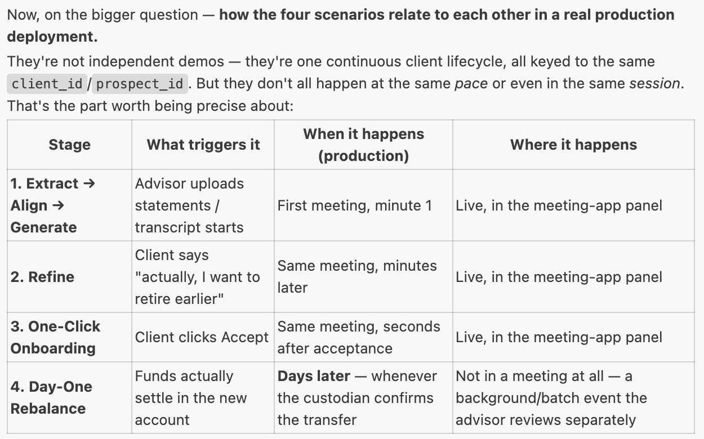

# Team 21: Debug & Conquer — Demo Scenarios & LLM Scripting

The AI is a **real-time collaborator sitting in the meeting**, not a form-filling tool. Every response should show the transition from a manual, time-consuming task to an automated, reasoned recommendation — that framing is what the judging rubric actually rewards.

## 1. The Four Demo Scenarios

### Scenario 1 — The "Messy" First Prospect Meeting (**the golden path opener** — build this one first)

- **Ask:** Prospect Sarah arrives with a stack of physical bank statements and a disorganized folder of investment PDFs.
- **Orchestration:** Extract Node parses the uploaded documents; Align Node scores risk tolerance against research material; Generate Node produces a preliminary plan.
- **Target moment:** The advisor uploads the documents live on screen, and within seconds a structured financial plan appears — the "wow" beat of the whole demo.

### Scenario 2 — The "What-If" Retirement Tweak (**the golden path's centerpiece** — build this second)

- **Ask:** Sarah says, mid-meeting, _"Actually, I want to retire three years earlier than we discussed."_
- **Orchestration:** The advisor drags a Retirement Age slider; the Refine Node loops back through Align/Generate with the new constraint.
- **Target moment:** The plan updates live on screen with no page reload, no re-upload — that's the "real-time" in the use case name.

### Scenario 3 — The "One-Click" Onboarding (stretch — build once 1 & 2 work)

- **Ask:** Sarah clicks "Accept" on the digital proposal.
- **Orchestration:** The system auto-triggers the account-open process and populates the Investment Policy Statement (IPS) across downstream systems.
- **Target moment:** A visual "data flowing into Broadridge/Client Source" animation, plus a populated IPS view the advisor can point at.

### Scenario 4 — The "Day One" Portfolio Rebalance (stretch — build last)

- **Ask:** Sarah's funds land in the new account.
- **Orchestration:** The system compares the current cash position against the IPS target mix and generates a rebalance recommendation for the advisor to review.
- **Target moment:** A "Review & Submit" screen showing the proposed trades — closes the loop from proposal to funded, invested account.

Build Scenarios 1 and 2 end to end first — together they _are_ the golden path and cover Creativity, Solution Design, GenAI Leverage, and UX. Only attempt 3 and 4 if there's time left; they exist to round out the "full lifecycle" story and answer Q&A, not to be a second rehearsed demo.

## 2. LLM Response Scripting Rubric

Every live response should hit all five rows below — this is what `system_prompts.py`'s `PROPOSAL_SYNTHESIS_PROMPT` (implementation_plan.md, Section 6) encodes directly.

| Criteria                             | Scripting instruction                                                            | Example phrase                                                                                                                      |
| ------------------------------------ | -------------------------------------------------------------------------------- | ----------------------------------------------------------------------------------------------------------------------------------- |
| **Creativity & Innovation**          | Don't just report the numbers — surface something the advisor might've missed.   | _"I've flagged that your 5-year university savings goal may not align with an Aggressive risk profile — here's a blended option."_  |
| **Solution Design & Implementation** | Explicitly name which node/stage produced what.                                  | _"Based on the extracted profile, Risk Alignment selected a 60/40 mix; Refine has now adjusted this given the new retirement age."_ |
| **GenAI Leverage & Application**     | Reference a specific detail pulled from the prospect's own documents/transcript. | _"Given your mention of retiring at 60 and your current tech-stock concentration, I've weighted this proposal accordingly."_        |
| **Intuition & User-Friendly Design** | Present one clear recommendation, not a spreadsheet of every fund considered.    | _"Here's your recommended mix — drag the risk slider if you'd like to see it adjust in real time."_                                 |
| **Potential Impact**                 | End every response with a concrete value statement.                              | _"This proposal is ready for your review in minutes, not days — no manual re-keying required."_                                     |

## 3. Presentation Tips

- **Show the loop, don't just claim it.** The tweak has to visibly re-run in front of judges — a static before/after screenshot won't land as "real-time."
- **Say the node names out loud.** "Extract," "Align," "Refine" are specific words judges are listening for — don't paraphrase them away.
- **Close every scenario with a time or effort saved statement**, even in Q&A.
