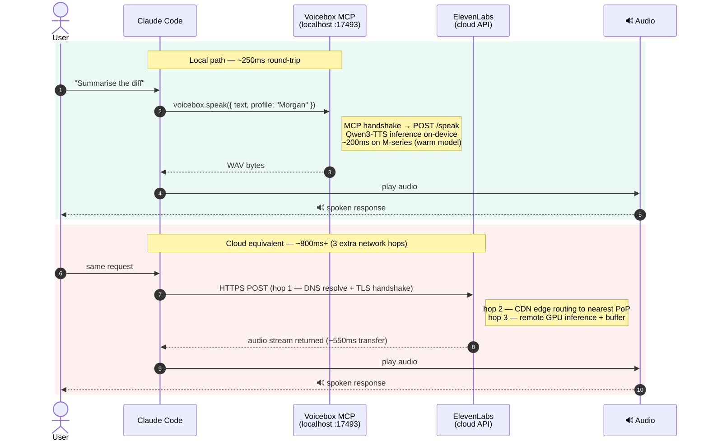

For the last two years, building anything voice-shaped meant the same architecture diagram: your code, an HTTPS call to ElevenLabs or WisprFlow, a credit card, and a latency budget you didn't control. The "voice layer" in your agent stack was a SaaS dependency you rented per-character.

That's quietly stopped being the only option. **Voicebox.sh** — open-sourced by Jamie Pine, the developer behind Spacedrive — bundles seven TTS engines, Whisper-based dictation, a local LLM for transcript cleanup, and a localhost REST + MCP server into a single Tauri desktop app. Everything runs on your machine. The same install that lets you dictate into VS Code also exposes a `POST /speak` endpoint that Claude Code or Cursor can call to talk back to you in your own cloned voice.

This isn't another wrapper around a hosted API. It's the first credible attempt at making the voice layer a **local primitive** the way Ollama made LLM inference a local primitive. And the MCP server is the interesting bit — because it means voice isn't a feature you bolt onto your agent, it's a tool your agent can call.

## What's actually in the box

Voicebox is one binary that ships with a surprising amount of infrastructure wired together. The architecture is worth understanding before you write a single line of integration code — the design decisions tell you what it's good for and where the routing decisions live.


The shell is **Tauri** — Rust binary, native window, no Electron overhead. The frontend is React/TypeScript. The actual work happens in a **FastAPI Python sidecar** that loads model weights and serves the API. The sidecar pattern matters: heavy ML dependencies (PyTorch, transformers, Whisper) are isolated from the desktop app, and the API is a real HTTP service you can hit from anything on the machine.

The model pool is where the project gets ambitious:

| Engine | Role | Notes |
|---|---|---|
| **Qwen3-TTS** | Primary TTS, voice cloning | Alibaba, January 2026. ~3s reference audio for cloning. |
| **Chatterbox** | Expressive TTS | ResembleAI open model. Better emotional range than Qwen3-TTS. |
| **Kokoro** | Lightweight TTS | Fast, low-resource. Good fallback for batch generation. |
| **LuxTTS / TADA / Hume** | Specialized voices | Each with different latency/quality tradeoffs. |
| **Whisper** | Speech-to-text | OpenAI open model. Powers the dictation hotkey. |
| **Qwen3 (LLM)** | Transcript cleanup, rewrites | Local, no API key, same model family as the TTS. |

You don't pick one and stay with it. The API lets you specify the engine per-request — route short confirmations through Kokoro for speed, long-form narration through Qwen3-TTS for quality, expressive dialogue through Chatterbox. That routing layer is the part you'd otherwise be building yourself.

## The localhost API is the actual product

Open the app, ignore the UI, go straight to `http://127.0.0.1:17493/docs`. That's FastAPI's auto-generated Swagger page, and it's the most honest documentation of what Voicebox can do.


The API surface is small enough to memorize:

```bash
# Generate speech from text
POST http://127.0.0.1:17493/speak
# body: { "text": "...", "voice_id": "...", "engine": "qwen3-tts" }

# Transcribe audio
POST http://127.0.0.1:17493/transcribe
# multipart audio upload — returns { "text": "...", "segments": [...] }

# Clone a new voice from a reference clip
POST http://127.0.0.1:17493/voices
# multipart, 10-30s of clean audio — returns voice_id

# List available voices and engines
GET http://127.0.0.1:17493/voices
GET http://127.0.0.1:17493/engines
```

Four endpoints and you've replaced the ElevenLabs SDK, the WisprFlow desktop app, and whatever you were paying for Whisper-1. A minimal Python integration:

```python
import requests

VOICEBOX = "http://127.0.0.1:17493"

def speak(text: str, voice_id: str = "default") -> bytes:
    r = requests.post(
        f"{VOICEBOX}/speak",
        json={"text": text, "voice_id": voice_id, "engine": "qwen3-tts"},
        timeout=30,
    )
    r.raise_for_status()
    return r.content  # WAV bytes

def transcribe(audio_path: str) -> str:
    with open(audio_path, "rb") as f:
        r = requests.post(
            f"{VOICEBOX}/transcribe",
            files={"audio": f},
            timeout=60,
        )
    r.raise_for_status()
    return r.json()["text"]
```

No API key. No rate limit. No egress. The consequence: latency drops from "depends on the internet" to "depends on your GPU." On an M-series Mac, first-token latency for Qwen3-TTS sits comfortably under 300ms once the model is warm. That's a categorically different product from a cloud TTS round-tripping through a remote ASGI gateway.


## The MCP server is where it gets architecturally interesting

The REST API is useful. The MCP server is what makes Voicebox a primitive instead of a tool.

**Model Context Protocol** is the standard Anthropic introduced for letting LLMs discover and call tools at runtime. An MCP server advertises tools by name, description, and JSON schema — any MCP-aware client (Claude Desktop, Claude Code, Cursor, Cline) discovers and calls them. Voicebox ships an MCP server out of the box on the same `127.0.0.1:17493`, exposing its capabilities as first-class agent tools:

- `voicebox.speak(text, voice_id?, engine?)`
- `voicebox.transcribe(audio_path)`
- `voicebox.list_voices()`
- `voicebox.clone_voice(audio_path, name)`

The implication most engineers miss on first read: once an agent has these tools, **voice is no longer a UI decision — it's a capability the agent invokes when it makes sense.**

Configure it once in Claude Code's MCP settings:

```json
{
  "mcpServers": {
    "voicebox": {
      "url": "http://127.0.0.1:17493/mcp",
      "transport": "http"
    }
  }
}
```

Restart the client. The voicebox tools appear in the tool list automatically — the agent discovers them via the MCP handshake, no further configuration needed.

Now your coding agent can read a long error trace aloud while you keep eyes on the editor, transcribe a five-minute voice memo into a structured PR description, or switch voice register based on context — calm for status updates, urgent for failures. The pattern that's emerging: **voice becomes the agent's observability channel.** When your agent finishes a long-running task, it doesn't log to stderr — it speaks the result. When CI fails at 11pm, you hear the summary while you're walking to your desk. The cognitive cost of context-switching back into a task drops when the agent narrates state changes.



## What developers are actually building

Five patterns showing up consistently across the issue tracker, the v0.5 release conversation on X, and early integrations in the wild.

### CLI tools that talk back

The simplest pattern and the one with broadest adoption. People are wiring Voicebox into `make deploy`, `pytest`, Terraform apply, and `cargo build` so the terminal speaks its result instead of demanding your attention. The implementation is usually a ten-line shell function piping output to `curl POST /speak`. It sounds gimmicky for a week, then becomes load-bearing — you stop polling terminals waiting for long tasks to finish.

```bash
# ~/.zshrc
notify_voice() {
  curl -s -X POST http://127.0.0.1:17493/speak \
    -H "Content-Type: application/json" \
    -d "{\"text\": \"$1\", \"voice_id\": \"default\"}" \
    --output /tmp/notify.wav && afplay /tmp/notify.wav
}

# Drop into any Makefile target or shell pipeline
long_running_build && notify_voice "Build passed" || notify_voice "Build failed"
```

### Voice-driven coding agents

The killer integration. Cline, Cursor, and Claude Code users are pairing Voicebox's MCP server with a push-to-talk hotkey — hold a key, describe what you want, dictation engine transcribes, agent acts, TTS reads back what it did. Total round-trip under two seconds for short interactions because nothing leaves the machine.

The part that does real work: **Qwen3 cleans up the transcription before it reaches the coding agent.** "Uh make the the function async and also fix the like the import order" becomes "Make the function async and fix the import order." Raw STT output is noise for a coding agent. Cleaned STT is a prompt.

### Local voice receptionist / IVR prototypes

A growing cohort is using Voicebox as the speech layer for telephony prototypes — Twilio or LiveKit handles SIP/WebRTC, Voicebox handles STT and TTS, a local agent loop handles the dialog logic.


The economics are the argument: no per-minute TTS billing, no PII leaving the machine, receptionist voice cloned from a single recording session. The self-hosted voice agent has a radically different cost structure from the fully managed version, and Voicebox is the first project that makes the speech layer easy enough that everything else becomes the bottleneck.

### Accessibility tooling

Developers building screen readers, focus-mode tools, and ADHD productivity apps have started routing through Voicebox because the latency and offline capability solve real constraints. A screen reader that depends on a network call is a screen reader that breaks on a plane or a flaky corporate VPN. Voicebox doesn't.

### Content production pipelines

Voice cloning is being used to draft narration for tutorials, podcasts, and YouTube videos — generate script, generate audio, edit. Output isn't broadcast-quality without post-processing, but for first-draft narration it's faster than recording and cheaper than ElevenLabs at scale. Several solo developers report they've stopped recording their own intros.

## How to get started

Three steps from zero to integrating.

### Install

Download the official binary from `voicebox.sh/download` or the GitHub releases page (`jamiepine/voicebox`). macOS DMG, Windows MSI, Linux AppImage. First launch pulls model weights — budget 5–10 GB disk for the default model set.

### Clone your voice

Open the app → **Voices → New** → record 15–30 seconds of clean audio. Quiet room, external mic if you have one. Embedding extraction runs locally, finishes in under a minute. The voice is now addressable via `voice_id` on every API call.

### Verify with curl

```bash
# Confirm the API is up and engines loaded
curl http://127.0.0.1:17493/engines

# First TTS call
curl -X POST http://127.0.0.1:17493/speak \
  -H "Content-Type: application/json" \
  -d '{"text": "Voicebox is running locally.", "voice_id": "default"}' \
  --output hello.wav && afplay hello.wav
```

That's the full onramp. From here the integration depth is whatever your project needs — direct HTTP calls, MCP tool registration in your agent client, or a thin SDK wrapper.

## Where this fits in the stack

The Ollama parallel is the right mental model: **Voicebox is to voice what Ollama is to inference.** Both take a capability previously rented from a managed API and turn it into a localhost primitive. Both ship as desktop apps with REST + MCP surfaces. Both make the cloud version optional rather than mandatory.

What changes when voice goes local is the same set of things that changed when inference went local:

| Dimension | Cloud TTS | Local Voicebox |
|---|---|---|
| **Latency** | ~800ms p50, network-bound | ~250ms p50 on M-series, GPU-bound |
| **Cost model** | Per-character or per-minute | Fixed hardware cost |
| **Data residency** | Audio transits vendor infra | Never leaves the machine |
| **Rate limits** | Vendor-imposed | None |
| **Offline** | ❌ | ✅ |
| **Enterprise procurement** | DPA required, vendor review | Internal infra, no third party |

For engineers in regulated industries — finance, healthcare, public sector — the data residency and procurement rows are the entire pitch. A locally hosted speech layer that exposes a clean HTTP API and an MCP server is exactly the shape of thing that clears the compliance review that would otherwise kill the project.

## The pattern worth internalizing

The bigger signal here isn't Voicebox specifically — it's the shape of the emerging local-first agent stack. Ollama for inference. Voicebox for voice. Mem0 or LangGraph for memory. Qdrant for retrieval. Each independently useful, but every one of them exposes the same surface: a localhost API plus an MCP server. An agent can compose them without integration glue — tool discovery handles the wiring.

If your agent stack today is a fan-out to hosted APIs, this is the architectural shift worth tracking. The cost curve, latency profile, and data flow all change when the primitives move local. Voicebox is the example you can install in twenty minutes and feel the difference.

The agents worth betting on for the next two years aren't the ones with the best model. They're the ones whose primitives — voice, memory, retrieval, inference — are local by default and reach for the cloud only when local isn't good enough yet. Voicebox is what makes the voice column of that bet viable today.
